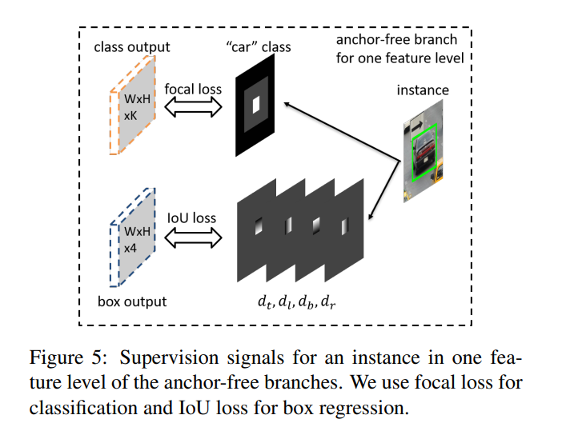

## 论文信息
* 论文名：Feature Selective Anchor-Free Module for Single-Shot Object Detection
* 作者：Chenchen Zhu, Yihui He, Marios Savvides(CMU)
* github link
* [arvix link](https://arxiv.org/pdf/1903.00621.pdf)

## 主要贡献（数据，模型，loss）
- 数据建模方式创新
- 网络反向更新参数创新(online feature selection)
- FocalLoss + IoULoss

## 文章细节(他山之石)
### 数据建模方式

- classification: N个物体，N个heatmap，每个bbox分为有效区域、忽略区域（不计算反向），分别用一个比例控制，有效区域分为物体中心的有效区域和没有物体的有效区域，计算loss的时候只计算有效区域的loss。注意，如果两个实例的 effective box 在一个特征级别上重叠，则较小的实例具有更高的优先级。
- regression：4*h*w，对于classification中每个有效点，计算改点与上下左右bbox的距离，作为回归量。此处用IoULoss计算，只计算物体中心的有效区域的loss。

### online feature selection
- 此处基于retinanet
- FPN结构每层分别计算FL+IoU，选择最小的层更新梯度，此处需要做到精确控制


## 借鉴点(可以攻玉)
- FSAF可以嫁接到任意网络作为最后一层输出（注：如果输入尺度太大，非常消耗显存，我单独做了一个实验：输入尺度512*512，主干网络HRNET-w18，取128*128维度的interpolate到512*512尺度，单张图片显存占用8.8G）
- 用这种数据建模的方式检测小目标
- IoULoss替代L2loss计算回归量(tlbr-->xyxy)
```python
def iou_loss(pred, target, eps=1e-6):
    ious = bbox_overlaps(pred, target, is_aligned=True).clamp(min=eps)
    loss = -ious.log()
    return loss
```
- focalLoss计算方式(目前使用第一种方式计算)
```python
pos_loss = -torch.log(pos_pred) * torch.pow(1-pos_pred, 2)
neg_loss = -torch.log(1 - neg_pred) * torch.pow(neg_pred, 2)# * neg_weights
num_pos  = pos_inds.float().sum()
pos_loss = pos_loss.sum()
neg_loss = neg_loss.sum()
return (pos_loss + neg_loss) / num_pos
```

```python
pos_num = pos_gt.size(0)
p = torch.sigmoid(pred_data)
gamma = 2
ce_loss = F.binary_cross_entropy_with_logits(p, gt_data, reduction="none")
p_t = p * gt_data + (1 - p) * (1 - gt_data)
loss = ce_loss * ((1 - p_t) ** gamma)
return loss.sum() / pos_num
```
- 选择性更新参数
- 参数初始化
```python
# Initialization
for modules in [self.conv_reshape, self.cls_subnet, self.bbox_subnet, self.cls_score, self.bbox_pred]:
    for layer in modules.modules():
        if isinstance(layer, nn.Conv2d):
            torch.nn.init.normal_(layer.weight, mean=0, std=0.01)
            torch.nn.init.constant_(layer.bias, 0)

# # Use prior in model initialization to improve stability
prior_prob = 0.01
bias_value = -math.log((1 - prior_prob) / prior_prob)
torch.nn.init.constant_(self.cls_score.bias, bias_value)
torch.nn.init.constant_(self.bbox_pred.bias, 0.5)
```
- extra(tensor操作)： permute, gt, reshape, gather
```python
gt_reshaped = gt.reshape(-1)
pred_reshaped = pred.reshape(-1)
pos_inds = gt_reshaped.eq(1)
neg_inds = gt_reshaped.eq(0)
pos_pred = pred_reshaped[pos_inds]
neg_pred = pred_reshaped[neg_inds]
pos_gt = gt_reshaped[pos_inds]
neg_gt = gt_reshaped[neg_inds]


gt_reshaped = gt.permute(0,2,3,1).reshape(-1,4)
pred_reshaped = pred.permute(0,2,3,1).reshape(-1,4)
pos_inds = gt_reshaped[:,0].gt(-0.1)
gt_pos = gt_reshaped[pos_inds]#.reshape(-1,4)
gt_xyxy = self.process_tlbr2xyxy(gt_pos)
pred_pos = pred_reshaped[pos_inds]#.reshape(-1,4)
pred_xyxy = self.process_tlbr2xyxy(pred_pos)
loss = self.loss_bbox(gt_xyxy, pred_xyxy)
```