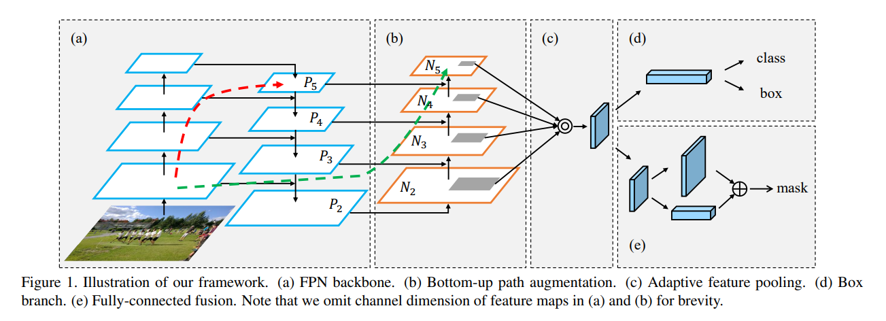
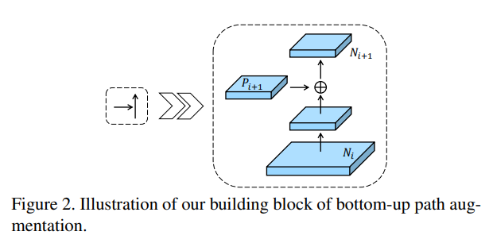
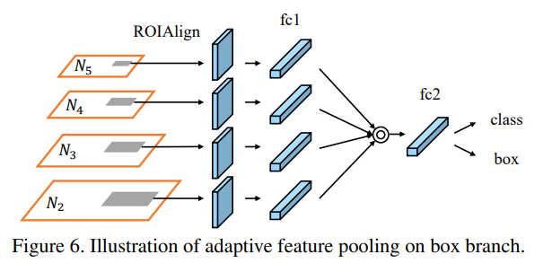

## 论文信息
* 论文名：Path Aggregation Network for Instance Segmentation
* 作者：Shu Liu, Lu Qi, Haifang Qin, Jianping Shi, Jiaya Jia（港中大、北大、商汤、优图）
* [github link](https://github.com/ShuLiu1993/PANet)
* [arvix link](https://arxiv.org/pdf/1803.01534.pdf)

## 主要贡献（模型改进）

- 模型改进，路径聚合（path aggregation)，主要在top level加上low level的shortcut；(features in low levels are helpful for large instance identification. But there is a long path from low-level structure to topmost features, increasing difficulty to access accurate localization information)

- adaptive feature pooling，主要是ROI Pooling（Align）的时候使用多层特征，然后做融合；(each proposal is predicted based on feature grids pooled from one feature level, which is assigned heuristically. This process can be updated since information discarded in other levels may be helpful for final prediction)

- FC fusion，针对mask分支，efficient and better generality.(mask prediction is made on a single view, losing the chance to gather more diverse information)

## 文章细节(他山之石)

- 下图是论文整体结构，分别是：FPN主干网络、自下而上的信息增强、自适应特征pooling、分类回归分支、mask回归分支（FC fusion）

- P层-->N层：

- 多层特征pooling（ROI Pooling/Align）

- FC fusion（仅针对mask分支）

## 借鉴点(可以攻玉)

- 路径聚合

- 多层特征pooling

- fusion
