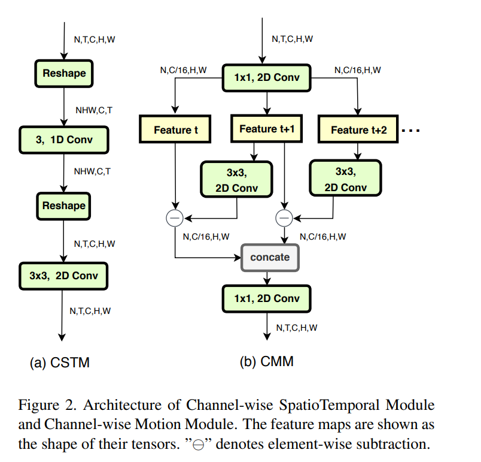
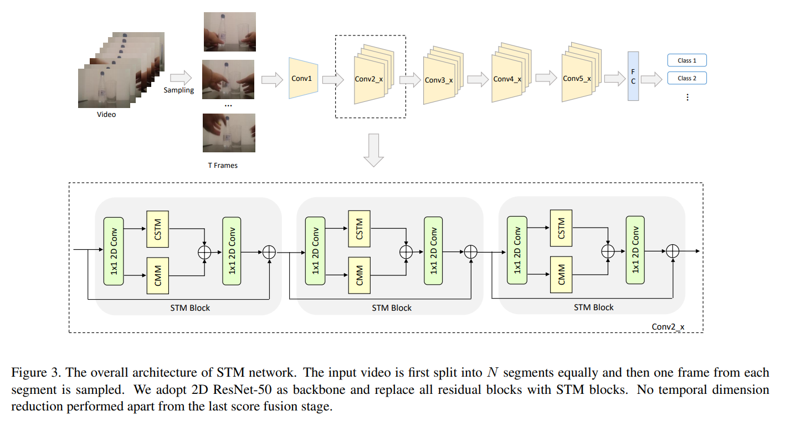

## 论文信息
* 论文名：STM: SpatioTemporal and Motion Encoding for Action Recognition
* 作者：Boyuan Jiang, MengMeng Wang, Weihao Gan, Wei Wu, Junjie Yan (SenseTime Group Limited, Zhejiang University)
* github link
* [arvix link](https://arxiv.org/pdf/1908.02486.pdf)

## 主要贡献（数据，模型，loss）
- 提出了新的网络组件

## 文章细节(他山之石)

## 借鉴点(可以攻玉)
