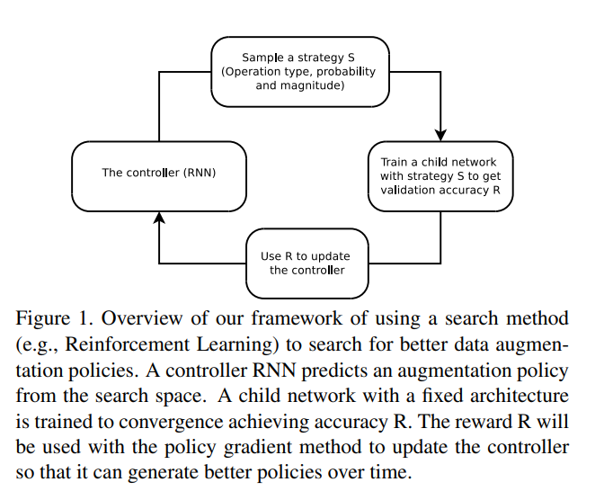

<head>
    
    
</head>

## 论文信息
* 论文名：AutoAugment: Learning Augmentation Policies from Data
* 作者：Ekin D. Cubuk, Barret Zoph, Dandelion Mane, Vijay Vasudevan, Quoc V. Le(Google Brain)
* [github link](https://github.com/DeepVoltaire/AutoAugment.git)
* [arvix link](https://arxiv.org/pdf/1805.09501.pdf)

## 主要贡献（数据，模型，loss）
- 用RL去搜索得到最佳的augment（GPU数量以百计算）
- 提供了CIFAR10， SVHN，ImageNet的augment策略（不同数据集的augment策略有所不同，需要重新训练）

## 文章细节(他山之石)
- RL不熟，只能放张概括图；

## 借鉴点(可以攻玉)
