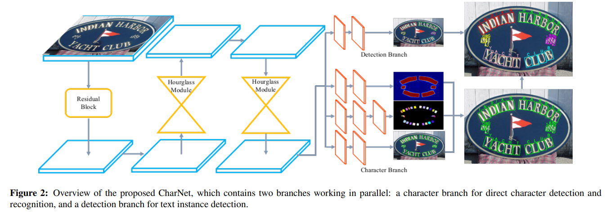

## 论文信息
* 论文名：Convolutional Character Networks
* 作者：Linjie Xing, Zhi Tian, Weilin Huang, and Matthew R. Scott1(码隆科技和Adelaide大学，其中Zhi Tian是CTPN、FCOS作者)
* [github link](https://github.com/MalongTech/research-charnet)
* [arvix link](https://arxiv.org/pdf/1910.07954.pdf)

## 主要贡献（数据，模型，loss）
- 提出了CharNet网络（one-stage， detection和recognition同时进行

## 文章细节(他山之石)

- 之前别人都是检测和识别用2个网络来做，其中识别主要是用RNN（CTC），作者发现如果引入字符级的attention能提高识别的准确率，对基于RNN系列的文字识别来说，准确识别每个字符很重要，这inspire作者直接进行字符级的定位和识别，从而提出了end to end的网络；
- 网络结构如上图，训练图片经过residual block后，经过2层Hourglass，在1/4分辨率的图片上引出2个分支，一个是character分支，一个是detection分支；
- character分支用来做字符的定位和检测，包含3个子分支，text instance segmeentation(3x3,3x3,1x1), character detection(3x3,3x3,1x1) and character recognition(3x3,3x3,3x3,1x1)，其中text instance segmentation分支用来做监督，输出2维特征图（是否是text），character detection分支输出5维特征图，bbox和角度信息，character recognition分支输出68维概率图（总共检测68个字符）；
- detection分支用来整体识别text instance，同时也提供了内容信息用来group检测的字符，直接由字符组合成文本是heuristic and complicated，输出2维特征图表示是否有文字，5维检测结果（bbox和角度）；
- Iterative Character Detection，在synthetic数据上先生成一个模型，再拿着这个模型在real-world数据（只有文本级标注）上跑一边生成字符级标注，再重新训练模型；
- ICDAR2015: 1000 train + 500 val, Total-text: 1255 train + 300 val, ICDAR2017: 7200 train + 1800 val +9000 test;

## 借鉴点(可以攻玉)
- 用segmentation用来做监督，在训练关键点的时候可以用bbox做监督，LAB也是用shape做监督；
- 用生成的数据训练一个模型，用来弱监督真实场景的数据标注信息。
