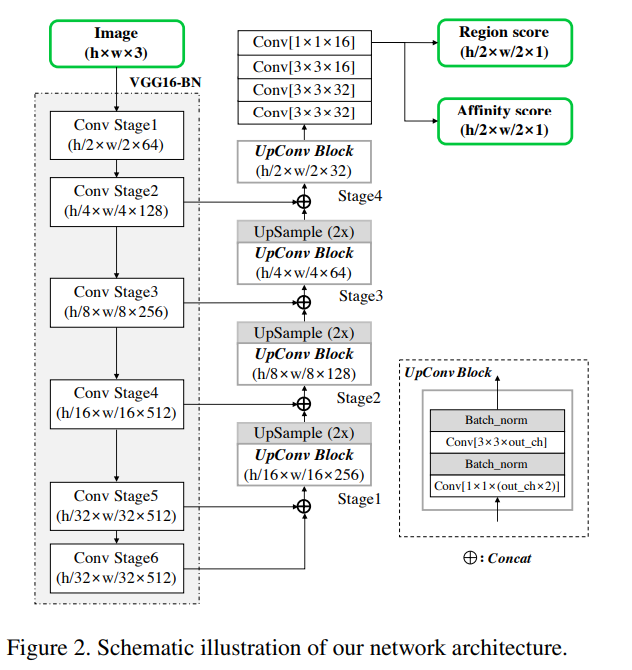
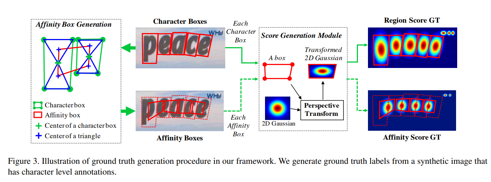
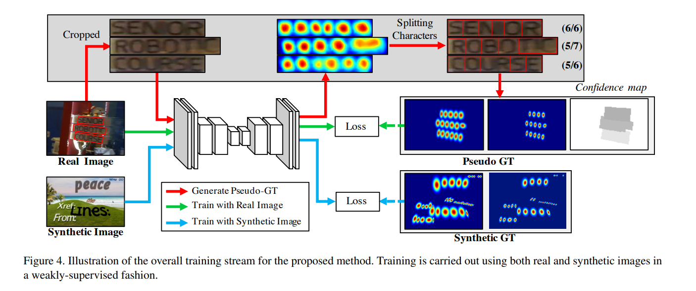
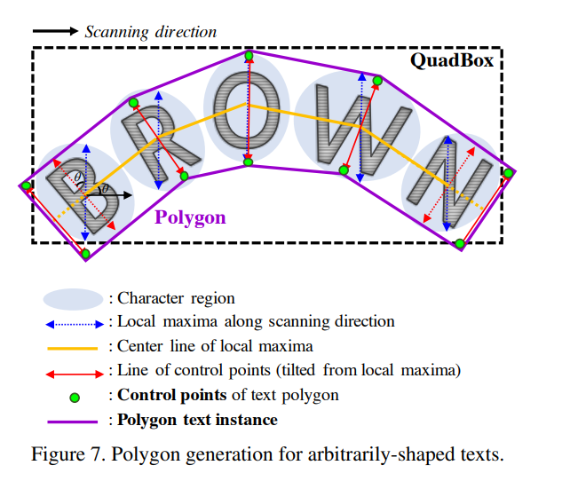

## 论文信息
* 论文名：CRAFT: Character-Region Awareness For Text detection
* 作者：Youngmin Baek, Bado Lee, Dongyoon Han, Sangdoo Yun, Hwalsuk Lee.(Clova AI Research)
* [github link](https://github.com/clovaai/CRAFT-pytorch)
* [arvix link](if exists)

## 主要贡献（数据，模型，loss）
- 提出了新的网络CRAFT，利用字符和字符间的空格做场景文字检测；

## 文章细节(他山之石)
- 这篇文章看的时间比较早了，放几张图；
- 主干网络结构；

- 生成gt的方法；

- 弱监督方式训练（和charnet有点像，因为字符级标注数据不好标）；

- 从字符聚合成文本；

## 借鉴点(可以攻玉)
- 已经在项目中使用，不过显存占用偏高。