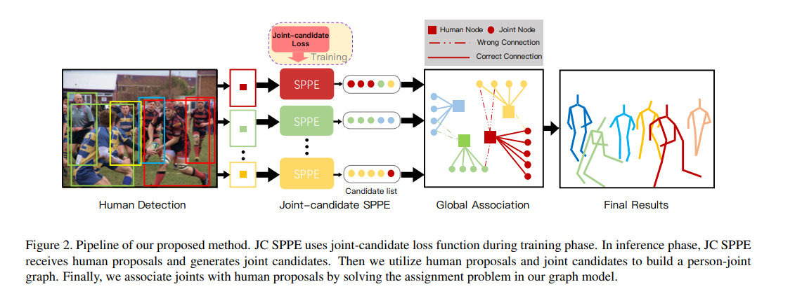

## 论文信息
* 论文名：CrowdPose: Efficient Crowded Scenes Pose Estimation and A New Benchmark
* 作者：Jiefeng Li, Can Wang, Hao Zhu, Yihuan Mao, Hao-Shu Fang, Cewu Lu(Shanghai Jiao Tong University, Tsinghua University)
* [github link](https://github.com/Jeff-sjtu/CrowdPose)
* [arvix link](https://arxiv.org/pdf/1812.00324.pdf)

## 主要贡献（数据，模型，loss）
- 把姿态估计问题转换成图匹配问题（全局优化）
- 提出了新的数据集（CrowdPose）

## 文章细节(他山之石)

- 有一个person detector检测出所有的person
- 每个SPPE（单人姿态估计）检测所有的节点（joints），不做过滤
- 生成节点图和person图，判断图中人与节点是否属于真正的连接

## 借鉴点(可以攻玉)
- 问题转换：姿态估计转换成图匹配问题（亮点）
- 内部细节还没细看，后续有这块需求来补