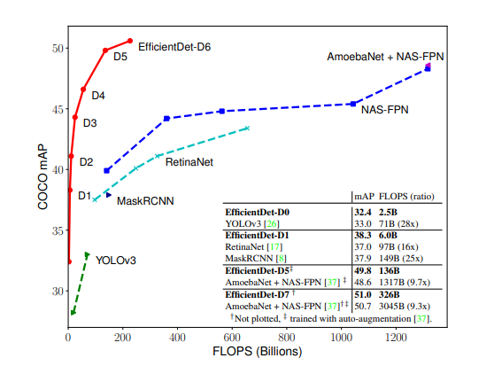
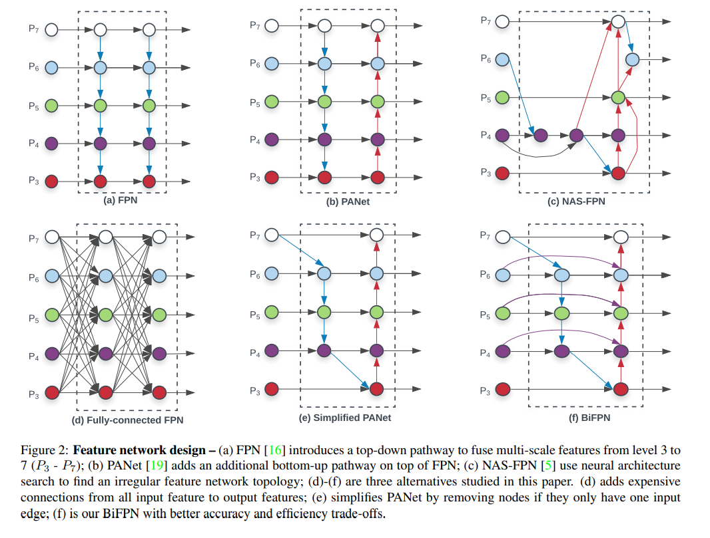
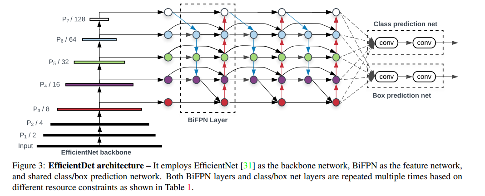
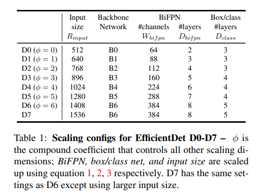
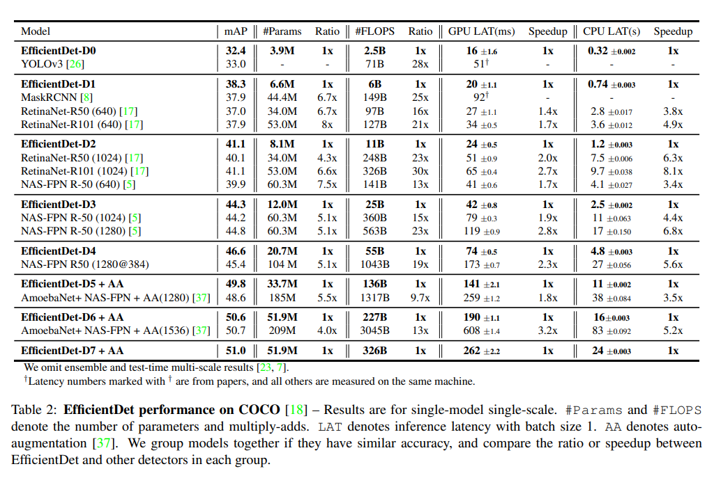

## 论文信息
* 论文名：EfficientDet: Scalable and Efficient Object Detection
* 作者：Mingxing Tan, Ruoming Pang, Quoc V. Le(Google Research, Brain Team)(EfficientNet提出的团队)
* [github link]
* [arvix link](https://arxiv.org/pdf/1911.09070.pdf)

## 主要贡献（数据，模型，loss）
- 新的模型：主干网络采用EfficientNet，改进FPN（BiFPN）；
- 综合考虑这些内容：主干网络、特征网络、cls/reg网络、分辨率。

## 文章细节(他山之石)
- BiFPN很高效，可以重复使用，另外不同层融合的时候经过加权处理；

- 网络相关参数

- coco结果

## 借鉴点(可以攻玉)
- 尝试复现。