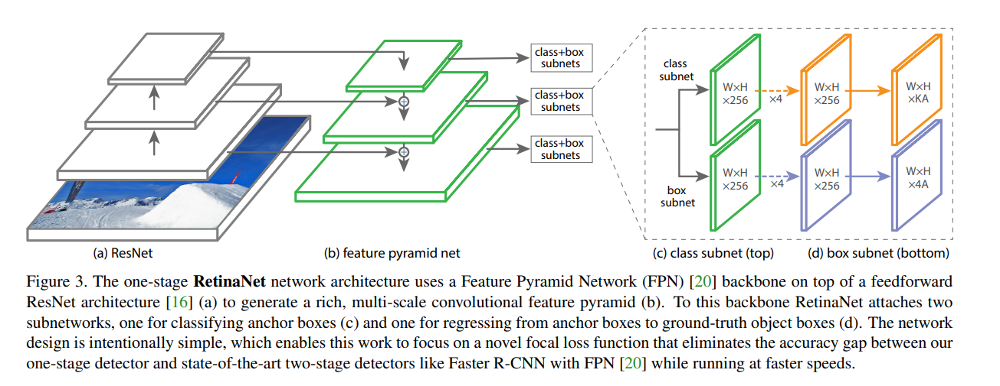

<head>
    <script src="https://cdn.mathjax.org/mathjax/latest/MathJax.js?config=TeX-AMS-MML_HTMLorMML" type="text/javascript"></script>
    <script type="text/x-mathjax-config">
        MathJax.Hub.Config({
            tex2jax: {
            skipTags: ['script', 'noscript', 'style', 'textarea', 'pre'],
            inlineMath: [['$','$$']]
            }
        });
    </script>
</head>


## 论文信息
* 论文名：paper name
* 作者：authors（institution）
* [github link](https://github.com/yhenon/pytorch-retinanet)
* [arvix link](https://arxiv.org/pdf/1708.02002.pdf)

## 主要贡献（新的模型，新的loss）

- 提出了新的模型，新的loss

- 提出Focal Loss（针对前后景样本不均衡问题）(Our novel Focal Loss focuses training on a sparse set of hard examples and prevents the vast number of easy negatives from overwhelming the detector during training)

- 提出RetinaNet（用来验证focal loss的效果）

## 文章细节(他山之石)

- Focal Loss定义如下，CE是交叉熵（用于分类），p是为某一类的概率，可以看出，Focal Loss是在CE的基础上乘以了$$ (1-p_t)^\gamma $$的系数，对于$$p_t$$较大的，FL较小，对于$$p_t$$较小的，FL较大，可以看出，FL对于得分较低的样本有更大的系数，可以更好地参与反向（默认$$ \gamma=2$$）。

$$ CE(p, y) =  \begin{cases} -log(p) & \text {if $y$ = 1} \\ -log(1-p) & \text {otherwise} \end{cases} $$

$$ p_t =  \begin{cases} p & \text {if $y$ = 1} \\ 1-p & \text {otherwise} \end{cases} $$

$$ CE(p_t) = CE(p, y) = -log(p_t) $$

$$ FL(p_t) = (1-p_t)^\gamma CE(p_t)$$

- RetinaNet：如下图所示。

- 主干网络是res结构，res的结果每次输出依次上采样，形成FPN结构，对于FPN的**每个层**，会经过2个FCN网络（一个AK分类一个4A回归，分类：A个anchor，K个object classes）；

- 分类是Focal Loss去计算（与是否是这一类计算）；

- 回归是smooth L1计算（此处回归量是delta，GT是通过WxHxK个anchor boxes与GT计算得到
）



## 借鉴点(可以攻玉)

- Focal Loss( borrowed from fb fvcore)
```python
def sigmoid_focal_loss(
    inputs,
    targets,
    alpha: float = -1,
    gamma: float = 2,
    reduction: str = "none",
):
    """
    Loss used in RetinaNet for dense detection: https://arxiv.org/abs/1708.02002.
    Args:
        inputs: A float tensor of arbitrary shape.
                The predictions for each example.
        targets: A float tensor with the same shape as inputs. Stores the binary
                 classification label for each element in inputs
                (0 for the negative class and 1 for the positive class).
        alpha: (optional) Weighting factor in range (0,1) to balance
                positive vs negative examples. Default = -1 (no weighting).
        gamma: Exponent of the modulating factor (1 - p_t) to
               balance easy vs hard examples.
        reduction: 'none' | 'mean' | 'sum'
                 'none': No reduction will be applied to the output.
                 'mean': The output will be averaged.
                 'sum': The output will be summed.
    Returns:
        Loss tensor with the reduction option applied.
    """
    p = torch.sigmoid(inputs)
    ce_loss = F.binary_cross_entropy_with_logits(
        inputs, targets, reduction="none"
    )
    p_t = p * targets + (1 - p) * (1 - targets)
    loss = ce_loss * ((1 - p_t) ** gamma)

    if alpha >= 0:
        alpha_t = alpha * targets + (1 - alpha) * (1 - targets)
        loss = alpha_t * loss

    if reduction == "mean":
        loss = loss.mean()
    elif reduction == "sum":
        loss = loss.sum()

    return loss
```

- RetinaNet ( FPN )

- 初始化
```python
 # Initialization
for modules in [self.cls_subnet, self.bbox_subnet, self.cls_score, self.bbox_pred]:
    for layer in modules.modules():
        if isinstance(layer, nn.Conv2d):
            torch.nn.init.normal_(layer.weight, mean=0, std=0.01)
            torch.nn.init.constant_(layer.bias, 0)

# Use prior in model initialization to improve stability
prior_prob = 0.01
bias_value = -math.log((1 - prior_prob) / prior_prob)
torch.nn.init.constant_(self.cls_score.bias, bias_value)
```