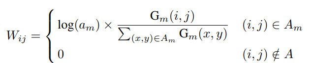

## 论文信息
* 论文名：Training-Time-Friendly Network for Real-Time Object Detection
* 作者：Zili Liu, Tu Zheng, Guodong Xu, Zheng Yang, Haifeng Liu, Deng Cai(State Key Lab of CAD&CG, Zhejiang University ,Fabu Inc.(何晓飞创办，滴滴出行前高级副总裁及研究员院长))
* [github link](https://github.com/ZJULearning/ttfnet)
* [arvix link](https://arxiv.org/pdf/1909.00700.pdf)

## 主要贡献（数据，模型，loss）
- 轻量级网络TTF-NET，快，训练快，推理快（1024*1024检测需要70ms）
- 集成多种最近的方法，如GIou，变种focal loss；
- 对CenterNet/CornerNet理解深入，见解独特。

## 文章细节(他山之石)
- 作者首先提出训练CenterNet很慢（比TTF-Net慢6-7倍），作者用更大的batch_size去训练，并且对hm的relu前乘以16加快收敛（经本人实验，先收敛hm，再收敛wh，此处很容易不收敛，需要多次尝试）；
- bbox采用iou loss进行回归，heatmap的值作为抑制参数乘以loss；
- hm生成方式采用了独特的hm椭圆生成方式，用sigma控制，此处与CenterNet和CornerNet都不一样，对于cls和reg分别用不同的sigma参数控制；
- TTF-NET网络：res18下采样，再上采样+原分辨率特征图，得到1/4尺度的输出图，在此基础上做cls和reg；
- 对于小目标，回归参数与面积比值有关，具体如下：

## 借鉴点(可以攻玉)
- 对于场景不是很复杂的场景可以直接使用；
- 看内部一些实现的细节。