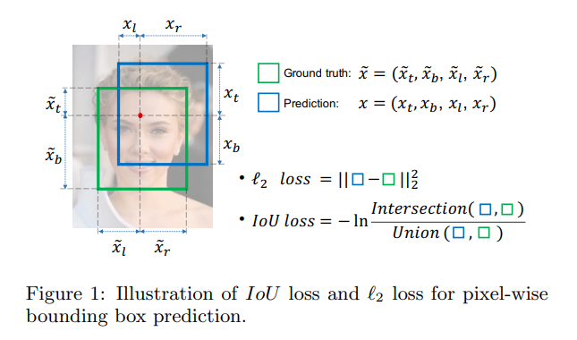
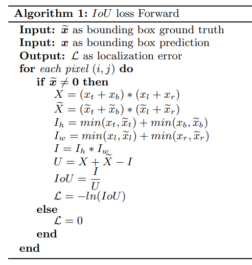
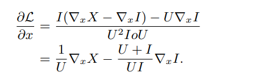

## 论文信息
* 论文名：UnitBox: An Advanced Object Detection Network
* 作者：Jiahui Yu1,2 Yuning Jiang2 Zhangyang Wang1 Zhimin Cao2 Thomas Huang1 ( UIU and Megvii)
* github link
* [arvix link](https://arxiv.org/pdf/1608.01471.pdf)

## 主要贡献（数据，模型，loss）
- 分类方面，FCN像素分类
- 坐标回归方面，提出了IOULoss，替代L2 loss

## 文章细节(他山之石)







- 从上面的计算可以看出，IoU Loss对x反向的时候，前一个是预测框的惩罚（正比），后一个是iou的系数（反比），因此为了最小化IoULoss，希望IoU区域尽可能大，然而预测框尽可能的小，从而可以同时优化4个坐标值，理想情况下，pred=gt。

## 借鉴点(可以攻玉)
- IoU Loss(from mmdet)
```python
def iou_loss(pred, target, eps=1e-6):
    """IoU loss.

    Computing the IoU loss between a set of predicted bboxes and target bboxes.
    The loss is calculated as negative log of IoU.

    Args:
        pred (Tensor): Predicted bboxes of format (x1, y1, x2, y2),
            shape (n, 4).
        target (Tensor): Corresponding gt bboxes, shape (n, 4).
        eps (float): Eps to avoid log(0).

    Return:
        Tensor: Loss tensor.
    """
    ious = bbox_overlaps(pred, target, is_aligned=True).clamp(min=eps)
    loss = -ious.log()
    return loss
```