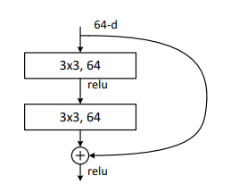
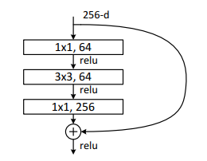

# BasicNeck and BottleNeck

## Basicneck

* path1: x--> (conv3x3+norm+relu) + (conv3x3+norm)
* path2: x--> x(downsample or not)
* path1 + path2 --> relu

## Bottleneck

* path1: x--> (conv1x1+norm+relu) + (conv3x3+norm+relu) + (conv1x1+norm) 
* path2: x--> x(downsample or not)
* path1 + path2 --> relu

## Bottle2neck

* path1: x--> (conv1x1+norm+relu) + split_and_cat + (conv1x1+norm)
* split_and_cat: split tensor into nums, each splits should be (conv3x3+norm+relu) 
* path2: x--> x(downsample or not)
* path1 + path2 --> relu