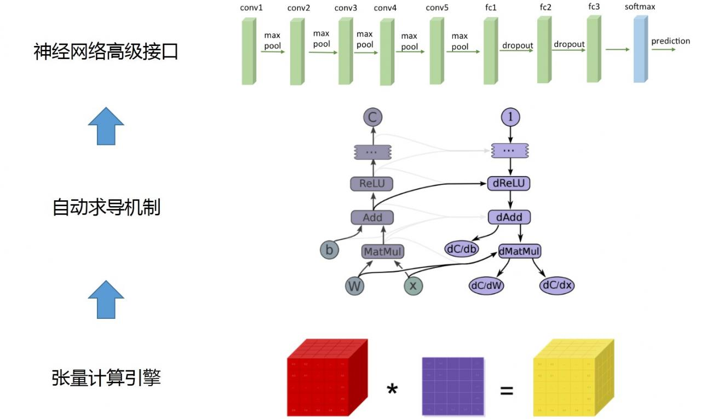

# pytorch

- pytorch 由低层到上层主要有三大块功能模块: Tensor, autograd, torch.nn。




## Directed Acyclic Graph（有向无环图）
- DAG contains nodes and edges
- Tensor(nodes, Variable merged into Tensor since v0.4)
- Function(edges, contains forward and backward function)


- Tensor mainly contains: data(forward Tensor), grad(backward Variable/Tensor), creator(also called grad_fn, connected Function)
 - Tensor also contains: requires_grad(if True, backward triggers, .grad, .detach()), grad_fn(None if created by user)


## Module and Function

- Module 是 pytorch 组织神经网络的基本方式。Module 包含了模型的参数以及计算逻辑。Function 承载了实际的功能，定义了前向和后向的计算逻辑。
- Function 是 pytorch 自动求导机制的核心类。Function 是无参数或者说无状态的，它只负责接收输入，返回相应的输出；对于反向，它接收输出相应的梯度，返回输入相应的梯度。
- Function 对象是 callable 的，即可以通过()的方式进行调用。其中调用的输入和输出都为 Variable 对象。
- 如果 backward 中需要用到 forward 的输入，需要在 forward 中显式的保存需要的输入。在上面的代码中，forward 利用ctx.save_for_backward函数，将输入暂时保存，并在 backward 中利用saved_tensors (python tuple 对象) 取出。
- Module 对象也是 callable 是，输入和输出也是 Variable。不同的是，Module 是可以有参数的。Module 包含两个主要部分：参数及计算逻辑（Function 调用）。由于ReLU激活函数没有参数，这里我们以最基本的全连接层为例来说明如何自定义Module。
- Function定义了基本的计算逻辑，Module 只需要在初始化时为参数分配内存空间，并在计算时，将参数传递给相应的 Function 对象。需要注意的是，参数是内存空间由 tensor 对象维护，但 tensor 需要包装为一个Parameter 对象。Parameter 是 Variable 的特殊子类，仅有是不同是 Parameter 默认requires_grad为 True。

## Pytorch中 Modules 和 Function 和 functional
### Module 和 F 都用于构造神经单元
- 二者都是torch / neural net 下的子模块
```python
import torch.nn.functional as F
import torch.nn.modules as M
import torch.autograd.Function as Function
```
### Module 和 F 都可用于构造模型
- 当计算单元无参数(Parameters)时， 可用F代替，直接写在forward函数中。
- 当计算单元有参数（Parameters）时， 必须写在init函数中，以子Module的方式，被注册进父Module。

### Module 是对 Function 的二次封装
- Function作为一个计算单元，其输入参数有显著区别，可归类为控制参数，模型参数，变量参数。

- 静态参数/控制参数int/float，比如kernel_size, io_channels，stride, padding等等，是模型内部相对静态的参数。

- 动态参数/模型参数Parameter，比如weights，bias等等，要随着训练不断迭代修改，是模型内部不断优化的可调整参数。

- 数据参数/输入变量Variable，就是输入数据Image, Text等等，是模型的外部输入变量。

因此，Function，可简单概括为 def func = F(input_Variable, model_Parameter, static_Value)

可见，Function作为一个神经计算单元是完备的，原理上，我们只使用Function也能构造出网络。

### 为什么要用Moduled对 F 进行二次封装呢？ 意义何在？

- 其实质就是，封装之后，使得Function的参数装填过程，被分割成了2个独立部分，实现了逻辑解耦！

- __init__用于装填静态控制参数，模型参数，因此与模型构造有关的逻辑，被完全分割在init之内！
- forward用于装填数据参数，，与数据输入有关的逻辑，被完全分割在forward之内！
- __init__, forward可以在不同的阶段进行独立调用，从而使得模型构建，数据处理相互独立，实现解耦！
- forward内部封装了Python的__call__, 可使得类变成可调用对象！即model(input)

### M和F的使用区别
```python
# 构造和使用相互分离，解耦合！
conv2d = M.Conv2d(模型参数，静态参数)
output = conv2d(数据参数)
# 构造和使用混合在一起，强耦合！
output = F.conv2d(数据参数，模型参数，静态参数)
F.conv2d(数据参数，模型参数，静态参数)：
    模型构造 & 数据处理， 完全混合在一起！
```

### 如何自定义Module和Function
- Module中有__init__()，forward(), 但是没有backward()。

- Function中有forward() 和 backward()，但是__init__()可有可无。

因此，自定义模块，要同时定义Module 和 Fucntion.

### OOP本质论
首先，F的参数有强烈的可分类性质！因此，可设计为不同的类，再加以组合！
其次，python内置函数__call__，可以将类变成一个可调用对象callabel！
最后，说明充分使用Python内置函数的好处。

- __init__可以将类初始化！
- __call__可以将类变为可调用对象！
- __iter__和__next__可以将类变为可迭代对象！


## Function与Module的差异与应用场景
Function与Module都可以对pytorch进行自定义拓展，使其满足网络的需求，但这两者还是有十分重要的不同：
- Function一般只定义一个操作，因为其无法保存参数，因此适用于激活函数、pooling等操作；Module是保存了参数，因此适合于定义一层，如线性层，卷积层，也适用于定义一个网络
- Function需要定义三个方法：__init__, forward, backward（需要自己写求导公式）；Module：只需定义__init__和forward，而backward的计算由自动求导机制构成
- 可以不严谨的认为，Module是由一系列Function组成，因此其在forward的过程中，Function和Variable组成了计算图，在backward时，只需调用Function的backward就得到结果，因此Module不需要再定义backward。
- Module不仅包括了Function，还包括了对应的参数，以及其他函数与变量，这是Function所不具备的

 ## 扩展 torch.autograd
如果你想要添加一个新的 Operation 到autograd的话，你的Operation需要继承 class Function。autograd使用Function计算结果和梯度，同时编码 operation的历史。每个新的 operation(function) 都需要实现三个方法：

- __init__ (optional) - 如果你的operation包含非Variable参数，那么就将其作为__init__的参数传入到operation中。例如：AddConstant Function加一个常数，Transpose Function需要指定哪两个维度需要交换。如果你的operation不需要额外的参数，你可以忽略__init__。

- forward() - 在里面写执行此operation的代码。可以有任意数量的参数。如果你对某些参数指定了默认值，则这些参数是可传可不传的。记住：forward()的参数只能是Variable。函数的返回值既可以是 Variable也可以是Variables的tuple。同时，请参考 Function[function]的 doc，查阅有哪些 方法是只能在forward中调用的。

- backward() - 梯度计算公式。 参数的个数和forward返回值的个数一样，每个参数代表传回到此operation的梯度. backward()的返回值的个数应该和此operation输入的个数一样，每个返回值对应了输入值的梯度。如果operation的输入不需要梯度，或者不可导，你可以返回None。 如果forward()存在可选参数，你可以返回比输入更多的梯度，只是返回的是None。

## 扩展 torch.nn
nn 包含两种接口 - modules和他们的functional版本。通过这两个接口，你都可以扩展nn。但是我们建议，在扩展layer的时候，使用modules， 因为modules保存着参数和buffer。如果不需要参数的话，那么建议使用functional(激活函数，pooling，这些都不需要参数)。

增加一个operation的 functional版本已经在上面一节介绍完毕。

增加一个模块(module)。 由于nn重度使用autograd。所以，添加一个新module需要实现一个 用来执行 计算 和 计算梯度 的Function。从现在开始，假定我们想要实现一个Linear module，记得之前我们已经实现了一个Linear Funciton。 只需要很少的代码就可以完成这个工作。 现在，我们需要实现两个方法：

- __init__ (optional) - 输入参数，例如kernel sizes, numbers of features, 等等。同时初始化 parameters和buffers。

- forward() - 实例化一个执行operation的Function，使用它执行operation。和functional wrapper(上面实现的那个简单的wrapper)十分类似。

## references:
- https://www.pytorchtutorial.com/docs/notes/extending/
- https://blog.csdn.net/mdjxy63/article/details/79474966
- https://blog.csdn.net/liuweiyuxiang/article/details/84556379
- https://www.pytorchtutorial.com/pytorch-how-to-write-your-own-module/
- http://studyai.com/article/178e7562